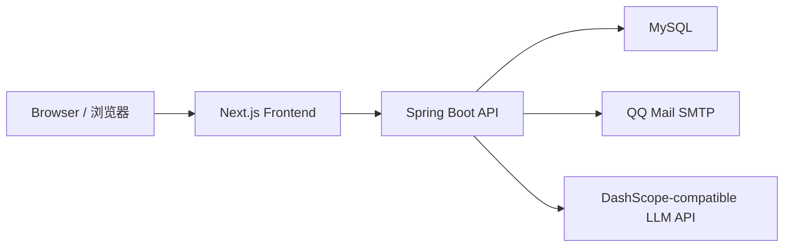

# CVResume / 简历救兵


> AI-powered resume generation platform with bilingual UX, credits, marketplace, admin operations, and self-hosted deployment support.
>
> 一个支持中英双语、积分体系、共享市场、后台运营和自部署的 AI 简历平台。

## Table of Contents | 目录

- [Overview | 项目简介](#overview--项目简介)
- [Highlights | 核心能力](#highlights--核心能力)
- [Architecture | 架构概览](#architecture--架构概览)
- [Tech Stack | 技术栈](#tech-stack--技术栈)
- [Repository Layout | 仓库结构](#repository-layout--仓库结构)
- [Quick Start | 快速开始](#quick-start--快速开始)
- [Deployment | 部署](#deployment--部署)
- [Project Docs | 模块文档](#project-docs--模块文档)
- [Roadmap | 后续计划](#roadmap--后续计划)
- [Contributing | 贡献方式](#contributing--贡献方式)
- [License | 开源协议](#license--开源协议)

## Overview | 项目简介

`CVResume` is a full-stack resume generation platform built for JD-targeted resume creation, resume sharing, credits-based purchases, and lightweight platform operations.

`CVResume`（中文产品名：`简历救兵`）是一个围绕岗位定制简历生成打造的全栈平台，覆盖了项目创建、异步生成、积分购买、共享市场、后台运营和用户支持等能力。

## Highlights | 核心能力

- `AI resume generation / AI 简历生成`：Create projects from a JD and raw resume, generate tailored resumes asynchronously, retry jobs, switch templates, and polish results.
- `Resume editing workflow / 简历编辑工作流`：Preview, edit, rearrange modules, and export the final resume from the frontend workspace.
- `Credits and commerce / 积分与交易体系`：Support credit packages, redemption products, order history, and custom credit top-up flows.
- `Manual QR payment / 人工扫码支付`：Current purchase flow supports manual Alipay and WeChat QR code payment for individual payment accounts.
- `Marketplace and sharing / 共享市场`：Publish resumes, browse shared resumes, record views/usages, and manage personal shared entries.
- `Auth and user system / 登录与用户体系`：Email code login/registration, profile editing, invitation tracking, and mocked OAuth provider flow.
- `Admin operations / 后台运营能力`：Manage users, adjust credits, create products, generate redemption codes, and inspect orders.
- `Support tools / 支持能力`：Feedback submission and chat session history are included for lightweight user support scenarios.

## Architecture | 架构概览



- `Frontend / 前端`：`Next.js App Router + TypeScript + Tailwind CSS + next-intl`
- `Backend / 后端`：`Spring Boot 3 + Spring Security + JDBC`
- `Persistence / 存储`：`MySQL` multi-table persistence
- `Deployment / 部署`：Optimized for self-hosting with `Nginx + Node.js + Java`

## Tech Stack | 技术栈

| Layer | Stack |
| --- | --- |
| Frontend | Next.js 14, React 18, TypeScript, Tailwind CSS, next-intl, next-themes, lucide-react |
| Backend | Java 21, Spring Boot 3.3, Spring Security, Spring Mail, Spring Actuator, JDBC |
| Database | MySQL 8 |
| Tooling | Maven 3.9, npm, SDKMAN, Baota/Nginx-friendly production topology |

## Repository Layout | 仓库结构

```text
.
├── backend/                 # Spring Boot API and persistence layer
├── frontend/                # Next.js application
├── package.json             # Root helper scripts
├── .sdkmanrc                # Project-pinned Java and Maven versions
└── README.md
```

## Quick Start | 快速开始

### Prerequisites | 环境要求

- `Node.js 20+`
- `Java 21`
- `Maven 3.9+`
- `MySQL 8`

### 1. Clone | 拉取代码

```bash
git clone https://github.com/youthwing/CVresume.git
cd CVresume
```

### 2. Start the backend | 启动后端

Backend defaults:

- host: `127.0.0.1`
- port: `3306`
- database: `crseume`
- username: `root`
- password: `000018`

```bash
source "$HOME/.sdkman/bin/sdkman-init.sh"
sdk env
mvn -f backend/pom.xml spring-boot:run
```

Optional mail-related environment variables:

```bash
MAIL_USERNAME="your@qq.com" \
MAIL_PASSWORD="your_qq_smtp_authorization_code" \
AUTH_MAIL_FROM="your@qq.com" \
DASHSCOPE_API_KEY="your_dashscope_api_key" \
mvn -f backend/pom.xml spring-boot:run
```

### 3. Start the frontend | 启动前端

```bash
cd frontend
cp .env.example .env.local
npm install
npm run dev
```

Default frontend URL: `http://localhost:3000`

### 4. Root helper scripts | 根目录快捷命令

```bash
npm run dev:frontend
npm run dev:backend
npm run build:frontend
npm run build:backend
```

## Deployment | 部署

Recommended production topology:

- `Nginx` serves the public domain
- `Next.js` runs on `127.0.0.1:3000`
- `Spring Boot` runs on `127.0.0.1:8080`
- Browser requests `/api/*` through the same domain

For a full Baota-friendly setup, see:

- [frontend/README.md](frontend/README.md)
- [backend/README.md](backend/README.md)

### Docker Compose

The repository now includes first-party Docker deployment files:

- `docker-compose.yml`
- `docker-compose.external-db.yml`
- `.env.docker.example`
- `.env.docker.cn.example`
- `frontend/Dockerfile`
- `backend/Dockerfile`

Quick start:

```bash
cp .env.docker.example .env
docker compose up -d --build
```

This starts:

- `mysql` on the internal Docker network
- `backend` bound to `127.0.0.1:8080`
- `frontend` bound to `127.0.0.1:3000`

Then keep Baota `Nginx` as the public reverse proxy to `127.0.0.1:3000` and `127.0.0.1:8080`.

If Docker Hub access is unstable, you can override the image sources in `.env`, for example:

```bash
MYSQL_IMAGE=m.daocloud.io/docker.io/library/mysql:8.0
NODE_IMAGE=m.daocloud.io/docker.io/library/node:22-bookworm-slim
MAVEN_IMAGE=m.daocloud.io/docker.io/library/maven:3.9.9-eclipse-temurin-21
JAVA_IMAGE=m.daocloud.io/docker.io/library/eclipse-temurin:21-jre-jammy
```

For servers in mainland China, you can start from the bundled mirror-aware template directly:

```bash
cp .env.docker.cn.example .env
docker compose up -d --build
```

`m.daocloud.io` is preconfigured in that template so you do not need to keep experimenting with Docker daemon mirrors first.

仓库现在已经内置了 Docker 部署文件。复制 `.env.docker.example` 为 `.env` 后，直接执行 `docker compose up -d --build` 即可启动数据库、后端和前端，再由宝塔 `Nginx` 做域名反向代理。

如果你的服务器在中国大陆，优先直接使用 `.env.docker.cn.example`。这个模板已经把 MySQL、Node、Maven 和 Java 基础镜像切到 `m.daocloud.io`，比继续反复切换 `daemon.json` 里的公共镜像站更稳。

If MySQL image pulls remain slow, you can reuse an existing host MySQL instance and only run the frontend and backend in Docker:

```bash
cp .env.docker.external-db.cn.example .env
docker compose -f docker-compose.external-db.yml up -d --build
```

That path avoids pulling `mysql:8.0` entirely and points the backend container at `host.docker.internal:3306`.

如果 MySQL 镜像仍然拉取很慢，可以直接复用宿主机已有的 MySQL，只让 Docker 跑前后端：

```bash
cp .env.docker.external-db.cn.example .env
docker compose -f docker-compose.external-db.yml up -d --build
```

这条路线完全绕开 `mysql:8.0` 镜像下载，后端容器直接走宿主机网络并连接 `127.0.0.1:3306`，更适合宝塔里“仅本地访问”的 MySQL。

Production frontend env example:

```bash
NEXT_PUBLIC_API_BASE_URL=/api
```

Production backend env example:

```bash
MYSQL_URL=jdbc:mysql://127.0.0.1:3306/crseume?createDatabaseIfNotExist=true&useUnicode=true&characterEncoding=utf8&useSSL=false&serverTimezone=Asia/Shanghai&allowPublicKeyRetrieval=true
MYSQL_USERNAME=root
MYSQL_PASSWORD=your_mysql_password
FRONTEND_BASE_URL=https://your-domain.com
APP_CORS_ALLOWED_ORIGIN_PATTERNS=https://your-domain.com,http://your-domain.com
MAIL_USERNAME=your@qq.com
MAIL_PASSWORD=your_mail_smtp_code
AUTH_MAIL_FROM=your@qq.com
DASHSCOPE_API_KEY=your_dashscope_api_key
```

## Project Docs | 模块文档

- [frontend/README.md](frontend/README.md): frontend architecture, environment variables, scripts, and deployment notes
- [backend/README.md](backend/README.md): backend modules, database model, runtime configuration, and operations notes

## Roadmap | 后续计划

- Add a real online payment integration when a business payment account is available
- Continue normalizing persistence from in-memory orchestration to repository-driven data access
- Improve automated testing coverage for core commerce and generation flows
- Improve contribution guidelines and release documentation

## Contributing | 贡献方式

Issues and pull requests are welcome.

欢迎通过 Issue 和 Pull Request 参与改进。

## License | 开源协议

This project is licensed under the Apache License 2.0. See the [`LICENSE`](LICENSE) file for the full text.

本项目采用 `Apache License 2.0` 开源协议，完整条款见 [`LICENSE`](LICENSE)。
