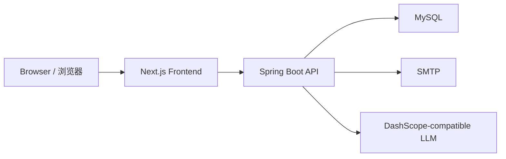

# CVResume / 简历救兵


> AI-powered resume platform for JD-targeted resume generation, bilingual workflows, credits, sharing, and self-hosted operations.
>
> 一个围绕岗位定制简历生成打造的全栈平台，支持中英双语、积分体系、共享市场和自部署运维。

## Overview | 项目简介

`CVResume` combines a `Next.js` frontend with a `Spring Boot` backend to cover:

- `AI resume generation / AI 简历生成`
- `Resume editing and export / 简历编辑与导出`
- `Credits, packages, and redemption / 积分、套餐与兑换`
- `Marketplace and sharing / 共享市场与分享`
- `Admin operations / 后台运营`
- `Feedback and support / 反馈与支持`

## Architecture | 架构概览



## Stack | 技术栈

| Layer | Stack |
| --- | --- |
| Frontend | Next.js 14, React 18, TypeScript, Tailwind CSS, next-intl |
| Backend | Spring Boot 3.3, Java 21, Spring Security, Spring JDBC, Spring Mail |
| Data | MySQL 8 |
| Deployment | Nginx, Node.js, Java, Docker Compose |

## Repository Layout | 仓库结构

```text
.
├── backend/                 # Spring Boot API and persistence layer
├── frontend/                # Next.js application
├── docker-compose.yml
├── docker-compose.external-db.yml
├── package.json             # Root helper scripts
└── README.md
```

## Security Notes | 安全说明

- No live credentials are committed to the repository.
- MySQL, SMTP, LLM, and seed-user passwords must be provided through environment variables.
- Seed users are disabled by default. Enable them only for local demos or test environments.

## Quick Start | 快速开始

### Prerequisites | 环境要求

- `Node.js 20+`
- `Java 21`
- `Maven 3.9+`
- `MySQL 8`

### 1. Clone | 拉取代码

```bash
git clone https://github.com/youthwing/CVresume.git
cd CVresume
```

### 2. Start Backend | 启动后端

```bash
source "$HOME/.sdkman/bin/sdkman-init.sh"
sdk env

MYSQL_URL='jdbc:mysql://127.0.0.1:3306/crseume?createDatabaseIfNotExist=true&useUnicode=true&characterEncoding=utf8&useSSL=false&serverTimezone=Asia/Shanghai&allowPublicKeyRetrieval=true' \
MYSQL_USERNAME='root' \
MYSQL_PASSWORD='your_local_mysql_password' \
APP_CORS_ALLOWED_ORIGIN_PATTERNS='http://localhost:3000,http://127.0.0.1:3000' \
mvn -f backend/pom.xml spring-boot:run
```

Optional local demo accounts:

```bash
APP_SEED_USERS_ENABLED='true' \
APP_DEMO_USER_PASSWORD='<set_demo_password>' \
APP_SHOWCASE_USER_PASSWORD='<set_showcase_password>' \
APP_ADMIN_PASSWORD='<set_admin_password>'
```

### 3. Start Frontend | 启动前端

```bash
cd frontend
cp .env.example .env.local
npm install
npm run dev
```

Default local URLs:

- Frontend: `http://localhost:3000`
- Backend: `http://localhost:8080`

### 4. Root Helper Scripts | 根目录快捷命令

```bash
npm run dev:frontend
npm run dev:backend
npm run build:frontend
npm run build:backend
```

## Production Build | 生产打包

Frontend standalone bundle:

```bash
NEXT_PUBLIC_API_BASE_URL=/api \
SKIP_BUILD_VALIDATION=true \
npm --prefix frontend run bundle:standalone
```

Backend package:

```bash
source "$HOME/.sdkman/bin/sdkman-init.sh"
sdk env
mvn -q -f backend/pom.xml -DskipTests package
```

Recommended runtime:

- `Nginx` serves the public domain
- Frontend runs on `127.0.0.1:3000`
- Backend runs on `127.0.0.1:8080`
- Browser requests `/api/*` through the same domain

## Deployment Options | 部署方式

### Standalone Upload | 本地打包上传

- Upload `frontend/.next/standalone`
- Run `node .next/standalone/server.js`
- Upload the packaged backend JAR and run it behind `systemd` or `pm2`

### Docker Compose

The repo also includes:

- `docker-compose.yml`
- `docker-compose.external-db.yml`
- `.env.docker.example`
- `.env.docker.cn.example`

Quick start:

```bash
cp .env.docker.example .env
docker compose up -d --build
```

## Module Docs | 模块文档

- [frontend/README.md](frontend/README.md)
- [backend/README.md](backend/README.md)

## License | 开源协议

Licensed under the Apache License 2.0. See [LICENSE](LICENSE).
